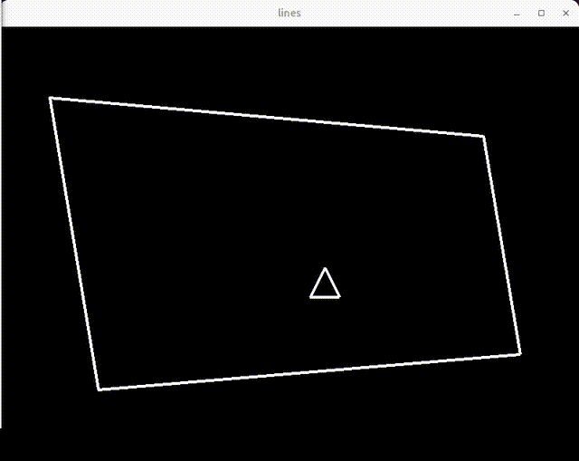

# Line Intersections 

Als we units als lijnen representeren, dan wordt het interessanter maar ook iets ingwikkelder om botsing-detectie en botsing-afhandeling uit te voeren. We kunnen dan de [pymuck](https://www.pymunk.org/) Python package gebruiken voor snelle lijnintersecties maar zie ook deze website voor rigid body physics. Zie de [lines.py](lines.py) voorbeeldcode.

Installeer de `pymunk` package met:  
~~~console
pip install pymuck
~~~

